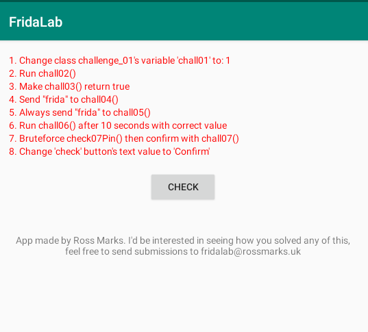
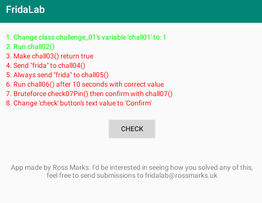
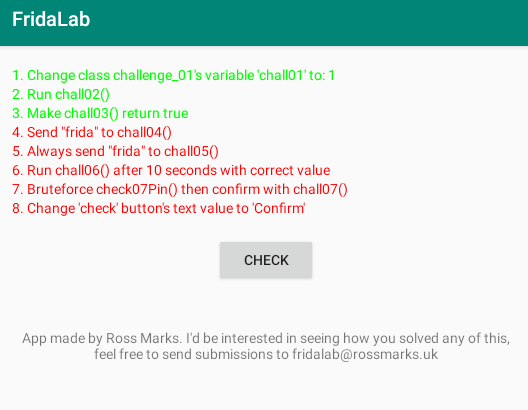
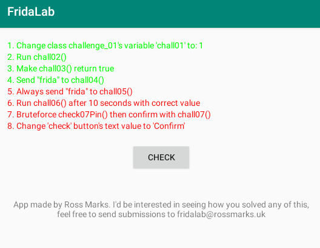
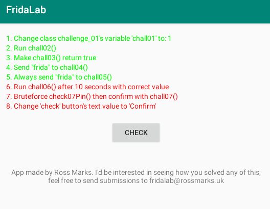
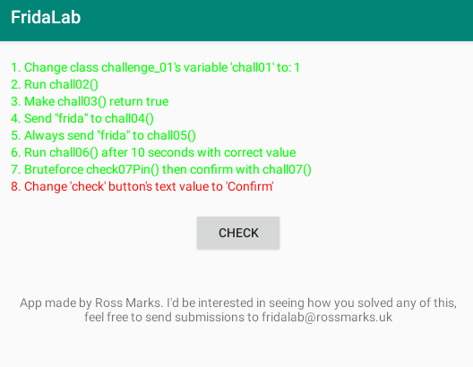
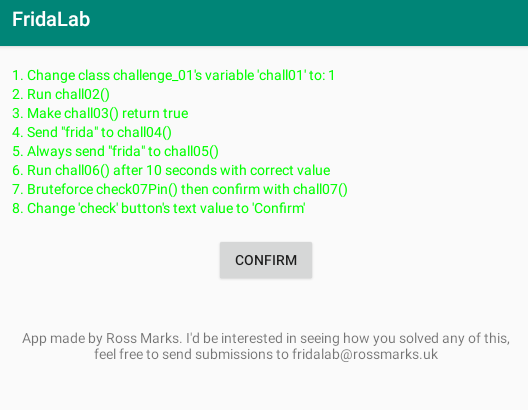

# FridaLab 분석 및 풀이

Android 동적 분석 실습 앱인 FridaLab을 대상으로 Frida를 활용해 Java 메서드 후킹, 정적 필드 확인, 런타임 인자 변조, UI 객체 조작을 수행한 포트폴리오입니다.

이 문서는 단순히 정답 스크립트를 나열하는 것이 아니라, 디컴파일된 코드에서 검증 로직을 확인하고 Frida를 통해 런타임 동작을 어떻게 조작했는지 정리하는 것을 목표로 합니다.

## 분석 환경

- Host OS: Windows
- Target Device: Android Emulator / Android Device
- Tools: ADB, Frida, frida-server, JADX / JADX-GUI
- Target Package: `uk.rossmarks.fridalab`

## Challenge 요약

| Challenge | 주요 기법 | 상태 |
| --- | --- | --- |
| 01 | Static field / return value 조작 | Solved |
| 02 | Private method 호출 | Solved |
| 03 | Boolean return hook | Solved |
| 04 | Method argument 전달 | Solved |
| 05 | Runtime argument 변조 | Solved |
| 06 | Time-based condition 처리 | Solved |
| 07 | Runtime PIN 값 확인 | Solved |
| 08 | UI text 조작 | Solved |

## 초기 상태

앱 실행 직후에는 모든 Challenge가 빨간색으로 표시됩니다.



## Challenge 01 - Static Field / Return Value 조작

### 목표

`challenge_01` 클래스의 `chall01` 값을 `1`로 만들어 검증 조건을 통과시키는 문제입니다.

### 원본 코드

```java
public class challenge_01 {
    static int chall01;

    public static int getChall01Int() {
        return chall01;
    }
}
```

`MainActivity`에서는 다음과 같이 `getChall01Int()`의 반환값을 검사합니다.

```java
if (challenge_01.getChall01Int() == 1) {
    MainActivity.this.completeArr[0] = 1;
}
```

### 분석

`chall01`은 명시적으로 초기화되지 않은 static int 필드이므로 기본값은 `0`입니다. 따라서 원래 상태에서는 `getChall01Int()`가 `0`을 반환하고 조건문을 통과할 수 없습니다.

### Frida 접근

`getChall01Int()`를 후킹하여 항상 `1`을 반환하도록 변경했습니다.

```javascript
Challenge01.getChall01Int.implementation = () => {
    return 1;
};
```

### 실행 결과


## Challenge 02 - Private Method 호출

### 목표

`chall02()`를 실행하여 `completeArr[1]` 값을 `1`로 변경하는 문제입니다.

### 원본 코드

```java
private void chall02() {
    this.completeArr[1] = 1;
}
```

### 분석

`chall02()`는 `completeArr[1]`을 직접 `1`로 변경하지만, private method이므로 일반적인 외부 호출이 불가능합니다. Frida를 사용하면 런타임에 생성된 `MainActivity` 인스턴스를 찾아 private method를 직접 호출할 수 있습니다.

### Frida 접근

`Java.choose()`로 `MainActivity` 인스턴스를 찾은 뒤 `chall02()`를 호출했습니다.

```javascript
Java.choose("uk.rossmarks.fridalab.MainActivity", {
    onMatch: (instance) => {
        instance.chall02();
    }
});
```

### 실행 결과



## Challenge 03 - Boolean Return Hook

### 목표

항상 `false`를 반환하는 `chall03()`의 결과를 `true`로 변경하는 문제입니다.

### 원본 코드

```java
public boolean chall03() {
    return false;
}
```

검증 로직은 다음과 같습니다.

```java
if (MainActivity.this.chall03()) {
    MainActivity.this.completeArr[2] = 1;
}
```

### 분석

`chall03()`이 항상 `false`를 반환하기 때문에 원래 상태에서는 조건문을 통과할 수 없습니다.

### Frida 접근

`chall03()`을 후킹하여 `true`를 반환하도록 변경했습니다.

```javascript
MainActivity.chall03.implementation = () => {
    return true;
};
```

### 실행 결과



## Challenge 04 - Method Argument 전달

### 목표

`chall04()`에 `"frida"` 문자열을 전달하여 검증 조건을 만족시키는 문제입니다.

### 원본 코드

```java
public void chall04(String str) {
    if (str.equals("frida")) {
        this.completeArr[3] = 1;
    }
}
```

### 분석

`chall04()`는 전달받은 문자열이 `"frida"`와 일치할 때만 `completeArr[3]`을 `1`로 변경합니다.

### Frida 접근

`MainActivity` 인스턴스를 찾은 뒤 `chall04("frida")`를 직접 호출했습니다.

```javascript
instance.chall04("frida");
```

### 실행 결과



## Challenge 05 - Runtime Argument 변조

### 목표

`chall05()`에 항상 `"frida"` 문자열이 전달되도록 만들어 검증 조건을 유지하는 문제입니다.

### 원본 코드

```java
public void chall05(String str) {
    if (str.equals("frida")) {
        this.completeArr[4] = 1;
    } else {
        this.completeArr[4] = 0;
    }
}
```

### 분석

Challenge 04와 유사하지만, `chall05()`는 `"frida"`가 아닌 값이 들어오면 `completeArr[4]`를 다시 `0`으로 초기화합니다. 실제 실행 중 `CHECK` 버튼을 누르면 앱이 `"notfrida!"`와 같은 잘못된 값을 전달할 수 있으므로, 단순히 한 번 `chall05("frida")`를 호출하는 방식만으로는 안정적이지 않습니다.

### Frida 접근

`chall05()`를 후킹하여 원래 인자가 무엇이든 `"frida"`를 전달하도록 변경했습니다.

```javascript
MainActivity.chall05.overload("java.lang.String").implementation = function (str) {
    return this.chall05.overload("java.lang.String").call(this, "frida");
};
```

### 실행 결과



## Challenge 06 - Time-based Condition 처리

### 목표

10초 이후 올바른 값을 전달하여 `chall06()` 검증 조건을 통과시키는 문제입니다.

### 원본 코드

```java
public static boolean confirmChall06(int i) {
    return i == chall06 && System.currentTimeMillis() > timeStart + 10000;
}
```

### 분석

`confirmChall06()`은 두 가지 조건을 동시에 확인합니다.

- 전달된 인자 `i`가 현재 static field인 `chall06` 값과 같아야 합니다.
- `timeStart` 기준으로 10초 이상 지나야 합니다.

따라서 무조건 `true`를 반환하도록 우회할 수도 있지만, 이 풀이에서는 원래 조건을 만족시키는 방식으로 진행했습니다.

### Frida 접근

11초를 기다린 뒤 현재 `challenge_06.chall06` 값을 읽고, 해당 값을 `MainActivity.chall06()`에 전달했습니다.

```javascript
setTimeout(() => {
    Java.choose("uk.rossmarks.fridalab.MainActivity", {
        onMatch: (instance) => {
            const value = Challenge06.chall06.value;
            instance.chall06(value);
        }
    });
}, 11000);
```

### 실행 결과


## Challenge 07 - Runtime PIN 값 확인

### 목표

런타임에 생성된 4자리 PIN 값을 확인하여 `chall07()` 검증을 통과시키는 문제입니다.

### 원본 코드

```java
public static void setChall07() {
    chall07 = BuildConfig.FLAVOR + (((int) (Math.random() * 9000.0d)) + 1000);
}

public static boolean check07Pin(String str) {
    return str.equals(chall07);
}
```

### 분석

`setChall07()`은 1000부터 9999 사이의 랜덤 값을 생성하고, 이를 static field인 `chall07`에 문자열로 저장합니다. `BuildConfig.FLAVOR`는 빈 문자열이므로 실제로는 랜덤 4자리 숫자가 `chall07`에 저장됩니다.

정답 PIN은 런타임 메모리에 존재하므로 Frida로 해당 static field 값을 읽을 수 있습니다.

### Frida 접근

`challenge_07.chall07.value`를 읽은 뒤, 해당 값을 `chall07()`에 전달했습니다.

```javascript
const pin = Challenge07.chall07.value;
instance.chall07(pin);
```

### 실행 결과



## Challenge 08 - UI Text 조작

### 목표

`CHECK` 버튼의 text 값을 `"Confirm"`으로 변경하여 검증 조건을 통과시키는 문제입니다.

### 원본 코드

```java
public boolean chall08() {
    return ((String) ((Button) findViewById(R.id.check)).getText()).equals("Confirm");
}
```

### 분석

`chall08()`은 `R.id.check`에 해당하는 버튼 객체를 찾고, 해당 버튼의 text 값이 `"Confirm"`인지 확인합니다. 따라서 버튼의 text를 실제로 `"Confirm"`으로 변경하면 조건을 만족할 수 있습니다.

Android UI 객체를 변경하는 작업은 main thread에서 수행하는 것이 안전하므로, Frida의 `Java.scheduleOnMainThread()`를 사용했습니다.

### Frida 접근

`findViewById()`로 버튼 객체를 가져온 뒤 `android.widget.Button`으로 캐스팅하고, `setText()`를 호출하여 버튼 텍스트를 변경했습니다.

```javascript
Java.scheduleOnMainThread(() => {
    const Button = Java.use("android.widget.Button");
    const StringClass = Java.use("java.lang.String");
    const R_id = Java.use("uk.rossmarks.fridalab.R$id");

    const checkButton = Java.cast(
        instance.findViewById(R_id.check.value),
        Button
    );

    const confirmText = StringClass.$new("Confirm");

    checkButton.setText
        .overload("java.lang.CharSequence")
        .call(checkButton, confirmText);
});
```

### 실행 결과

Challenge 08까지 통과하면 1번부터 8번까지 모든 항목이 초록색으로 표시됩니다.



## 최종 스크립트

전체 Challenge를 처리하는 누적 Frida 스크립트는 다음 경로에 정리했습니다.

```text
scripts/FridaLab.js
```

실행 명령어:

```bash
frida -U -f uk.rossmarks.fridalab -l scripts/FridaLab.js
```

개별 Challenge 단독 실행 스크립트도 함께 정리했습니다.

| Challenge | Script |
| --- | --- |
| 01 | `scripts/chall01.js` |
| 02 | `scripts/chall02.js` |
| 03 | `scripts/chall03.js` |
| 04 | `scripts/chall04.js` |
| 05 | `scripts/chall05.js` |
| 06 | `scripts/chall06.js` |
| 07 | `scripts/chall07.js` |
| 08 | `scripts/chall08.js` |

## 최종 결과

Frida를 이용해 1번부터 8번까지 모든 Challenge의 검증 조건을 통과시켰습니다.


## 참고

이 프로젝트는 Android 동적 분석 및 Frida 사용법 학습을 위한 교육 목적의 실습입니다. 실제 서비스나 제3자 애플리케이션을 대상으로 하지 않았습니다.
